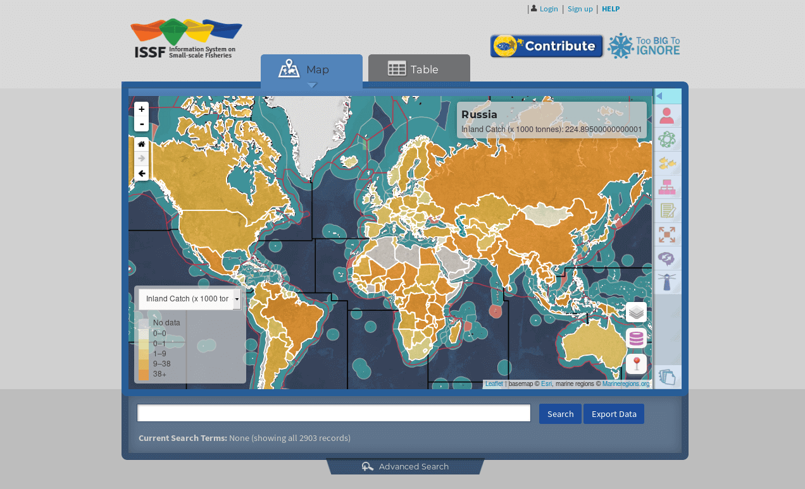

Information System on Small-Scale Fisheries (ISSF)
==================================================

A global, open-source collaborative database of information on small-scale
fisheries

The ISSF homepage, accessible `here <https://www.issfcloud.toobigtoignore.net>`_.

About
-----

The Information System on Small-Scale Fisheries (ISSF) is an open-source
research project to source information on small-scale fisheries from across
the globe. The project is built on top of Python and Django, PostGIS,
Foundation, and Docker.

Development
-----------

Clone the git repository with:

``git clone https://github.com/toobigtoignore/issf``

Create a dummy .env file

``cp issf_prod/.env.dist issf_prod/.env``

Then spin up the database container. From within the `issf` directory run:

``docker-compose up -d db``

Next, acquire the test database so we can import it. There is an automated script to handle the process of importing and populating the database with the data dump called ``./scripts/postgres_setup.sh``

After that, launch the existing containers with:

``docker-compose up -d``

Once the other containers are running, you will still need to install the `npm` packages on the ISSF container. Open a shell with ``./scripts/issf_shell.sh`` and run the npm installation commands.

Roadmap
-------

- v2.0.0

  - Upgrade to Django 2.0 and updated major Python libs
  - Migrated entire system to Docker containers with Docker Compose
  - Set up TravisCI
  - Set up NPM and Webpack
  - Added project documentation, written with Sphinx
  - Address all currently known bugs

Contributing
---------------------------------------------
Read our documentation `here <https://github.com/toobigtoignore/issf/wiki>`_ to contribute. Thank you for contributing!

See our list of contributors `here. <https://github.com/toobigtoignore/issf/graphs/contributors>`_

